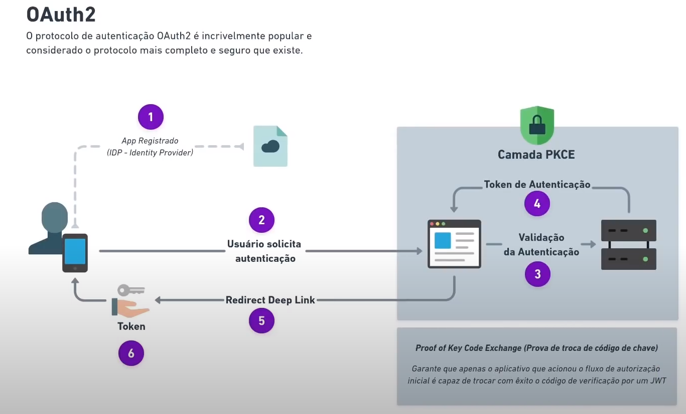

<h1 align="center">Login Social com OAuth2 no React Native</h1>

<h1 align="center">
    
</h1>

<br>

## 🧪 Tecnologias

Esse projeto foi desenvolvido com as seguintes tecnologias:

- [React Native](https://reactnative.dev/)
- [Expo](https://expo.dev/)
- [TypeScript](https://www.typescriptlang.org/)

## 🚀 Como executar

Clone o projeto e acesse a pasta do mesmo.

```bash
$ git clone https://github.com/diego64/oauth2-reactnative
$ cd oauth2-reactnative
```

Para iniciá-lo, siga os passos abaixo:
```bash
# Instalar as dependências
$ yarn

# Iniciar o projeto
$ expo start
```
Lembrando que será necessário criar uma conta no [Expo](https://expo.dev/), uma conta no G-mail, criar um projeto na plataforma de desenvolvimento da Google, preencher as autorizações, e criar um arquivo **.env** e preencher as informações iguais do arquivo **.env.example**

## 💻 Projeto

Aplicação React Native para listar algumas informações da conta G-mail

## 🔖 Base do projeto

Referencia do projeto foi do video [Code/drops#109](https://www.youtube.com/watch?v=pAt91MWwwvg&t=121s)